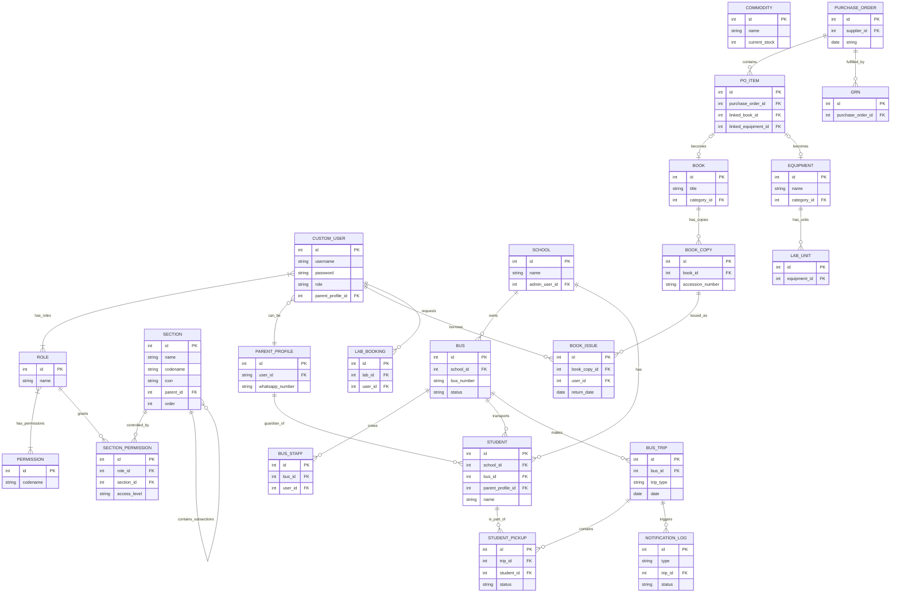

# Entity Relationship Diagram - School Management Platform

This illustrates the comprehensive relational schema of the unified `school_db` database.

```mermaid
erDiagram
    %% Accounts & RBAC
    CUSTOM_USER {
        int id PK
        string username
        string password
        string role
        int parent_profile_id FK
    }
    ROLE {
        int id PK
        string name
    }
    PERMISSION {
        int id PK
        string codename
    }
    SECTION {
        int id PK
        string name
        string codename
        string icon
        int parent_id FK
        int order
    }
    SECTION_PERMISSION {
        int id PK
        int role_id FK
        int section_id FK
        string access_level
    }
    SCHOOL {
        int id PK
        string name
        int admin_user_id FK
    }
    PARENT_PROFILE {
        int id PK
        string user_id FK
        string whatsapp_number
    }
    
    CUSTOM_USER }|--|{ ROLE : "has_roles"
    ROLE }|--|{ PERMISSION : "has_permissions"
    ROLE ||--o{ SECTION_PERMISSION : "grants"
    SECTION ||--o{ SECTION_PERMISSION : "controlled_by"
    SECTION ||--o{ SECTION : "contains_subsections"
    CUSTOM_USER }o--|| PARENT_PROFILE : "can_be"

    %% Bus Tracker
    BUS {
        int id PK
        int school_id FK
        string bus_number
        string status
    }
    BUS_STAFF {
        int id PK
        int bus_id FK
        int user_id FK
    }
    STUDENT {
        int id PK
        int school_id FK
        int bus_id FK
        int parent_profile_id FK
        string name
    }
    BUS_TRIP {
        int id PK
        int bus_id FK
        string trip_type
        date date
    }
    STUDENT_PICKUP {
        int id PK
        int trip_id FK
        int student_id FK
        string status
    }
    NOTIFICATION_LOG {
        int id PK
        string type
        int trip_id FK
        string status
    }
    
    SCHOOL ||--o{ BUS : "owns"
    SCHOOL ||--o{ STUDENT : "has"
    BUS ||--o{ BUS_STAFF : "crews"
    BUS ||--o{ STUDENT : "transports"
    BUS ||--o{ BUS_TRIP : "makes"
    BUS_TRIP ||--o{ STUDENT_PICKUP : "contains"
    STUDENT ||--o{ STUDENT_PICKUP : "is_part_of"
    BUS_TRIP ||--o{ NOTIFICATION_LOG : "triggers"
    PARENT_PROFILE ||--o{ STUDENT : "guardian_of"

    %% Library
    BOOK {
        int id PK
        string title
        int category_id FK
    }
    BOOK_COPY {
        int id PK
        int book_id FK
        string accession_number
    }
    BOOK_ISSUE {
        int id PK
        int book_copy_id FK
        int user_id FK
        date return_date
    }
    
    BOOK ||--o{ BOOK_COPY : "has_copies"
    BOOK_COPY ||--o{ BOOK_ISSUE : "issued_as"
    CUSTOM_USER ||--o{ BOOK_ISSUE : "borrows"

    %% Lab
    EQUIPMENT {
        int id PK
        string name
        int category_id FK
    }
    LAB_UNIT {
        int id PK
        int equipment_id FK
    }
    LAB_BOOKING {
        int id PK
        int lab_id FK
        int user_id FK
    }
    
    EQUIPMENT ||--o{ LAB_UNIT : "has_units"
    CUSTOM_USER ||--o{ LAB_BOOKING : "requests"

    %% Inventory
    COMMODITY {
        int id PK
        string name
        int current_stock
    }
    PURCHASE_ORDER {
        int id PK
        int supplier_id FK
        date string
    }
    PO_ITEM {
        int id PK
        int purchase_order_id FK
        int linked_book_id FK
        int linked_equipment_id FK
    }
    GRN {
        int id PK
        int purchase_order_id FK
    }
    
    PURCHASE_ORDER ||--o{ PO_ITEM : "contains"
    PURCHASE_ORDER ||--o{ GRN : "fulfilled_by"
    PO_ITEM |o--o| BOOK : "becomes"
    PO_ITEM |o--o| EQUIPMENT : "becomes"
```
